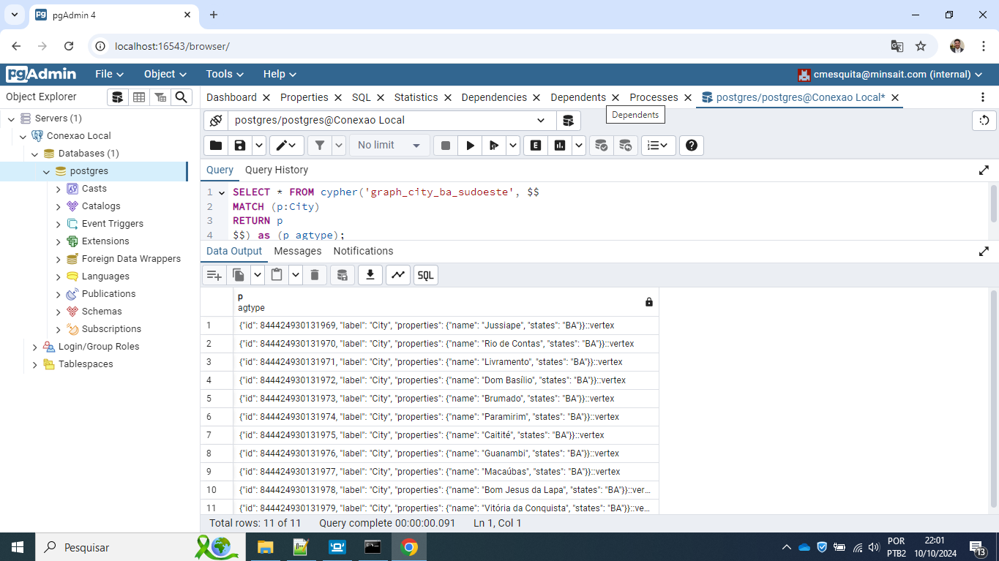

# Apache Age: funcionalidade data graph em PostgreSQL
Exemplo de como usar o Apache Age e PgAdmin com docker-compose.

## Instale o Rancher Desktop na sua máquina (caso esteja em Windows) e após inicialize o serviço


## Para provisionar o container do PostgreSQL com o módulo do Apache Age e PgAdmin:
Abra o terminal do promp do Dos e navegue no diretório que descompactou o docke-compose (pasta apache-age-municipios-main) e execute o comando para iniciar e provisionar os containers:
```docker-compose up -d```


## Com o containers iniciado:


## Abra o navegador e acesse o seguinte endereço para acessar o PostgreSQL via PgAdmin:
```http://localhost:16543/```


## Criando a conexão com o PostgreSQL:


## Uma vez com o acesso ao PostgreSQL selecione o menu ```Tools >> Query Tool```:


## Execute os comandos abaixo para criar o módulo da Apache Age no PostgreSQL e posteriormente carregando para utilizá-lo:

```CREATE EXTENSION age;```

```LOAD 'age';```

```SET search_path = ag_catalog, "$user", public;```


## Criamos o graph_name e posteriormente inserimos os registros da entidade City:

```SELECT create_graph('graph_city_ba_sudoeste');```

```SELECT * from cypher('graph_city_ba_sudoeste', $$
CREATE (A:City {name: "Jussiape", states: "BA"}),
    (B:City {name: "Rio de Contas", states: "BA"}),
    (C:City {name: "Livramento", states: "BA"}),
    (D:City {name: "Dom Basílio", states: "BA"}),
    (E:City {name: "Brumado", states: "BA"}),
    (F:City {name: "Paramirim", states: "BA"}),
    (G:City {name: "Caitité", states: "BA"}),
    (H:City {name: "Guanambi", states: "BA"}),
    (I:City {name: "Macaúbas", states: "BA"}),
    (J:City {name: "Bom Jesus da Lapa", states: "BA"}),
    (K:City {name: "Vitória da Conquista", states: "BA"})
$$) as (result agtype);```

Com isso temos o seguinte resultado:
```SELECT * FROM cypher('graph_city_ba_sudoeste', $$
MATCH (p:City)
RETURN p
$$) as (p agtype);```



## Criando relacionamento entre os nós:

```SELECT *
FROM cypher('graph_city_ba_sudoeste', $$
MATCH (A:City), (B:City)
WHERE A.name = 'Jussiape' AND B.name = 'Rio de Contas'
    CREATE (A)-[e:RELTYPE {name: A.name + '<->' + B.name, distance:35}]->(B)
RETURN e.name
$$) as (e agtype);```

```SELECT *
FROM cypher('graph_city_ba_sudoeste', $$
MATCH (A:City), (B:City)
WHERE A.name = 'Rio de Contas' AND B.name = 'Livramento'
    CREATE (A)-[e:RELTYPE {name: A.name + '<->' + B.name, distance:15}]->(B)
RETURN e.name
$$) as (e agtype);```

```SELECT *
FROM cypher('graph_city_ba_sudoeste', $$
MATCH (A:City), (B:City)
WHERE A.name = 'Livramento' AND B.name = 'Dom Basílio'
    CREATE (A)-[e:RELTYPE {name: A.name + '<->' + B.name, distance:20}]->(B)
RETURN e.name
$$) as (e agtype);```

```SELECT *
FROM cypher('graph_city_ba_sudoeste', $$
MATCH (A:City), (B:City)
WHERE A.name = 'Dom Basílio' AND B.name = 'Brumado'
    CREATE (A)-[e:RELTYPE {name: A.name + '<->' + B.name, distance:50}]->(B)
RETURN e.name
$$) as (e agtype);```

```SELECT *
FROM cypher('graph_city_ba_sudoeste', $$
MATCH (A:City), (B:City)
WHERE A.name = 'Livramento' AND B.name = 'Paramirim'
    CREATE (A)-[e:RELTYPE {name: A.name + '<->' + B.name, distance:70}]->(B)
RETURN e.name
$$) as (e agtype);```

```SELECT *
FROM cypher('graph_city_ba_sudoeste', $$
MATCH (A:City), (B:City)
WHERE A.name = 'Paramirim' AND B.name = 'Macaúbas'
    CREATE (A)-[e:RELTYPE {name: A.name + '<->' + B.name, distance:75}]->(B)
RETURN e.name
$$) as (e agtype);```


```SELECT *
FROM cypher('graph_city_ba_sudoeste', $$
MATCH (A:City), (B:City)
WHERE A.name = 'Brumado' AND B.name = 'Caitité'
    CREATE (A)-[e:RELTYPE {name: A.name + '<->' + B.name, distance:65}]->(B)
RETURN e.name
$$) as (e agtype);```


```SELECT *
FROM cypher('graph_city_ba_sudoeste', $$
MATCH (A:City), (B:City)
WHERE A.name = 'Brumado' AND B.name = 'Vitória da Conquista'
    CREATE (A)-[e:RELTYPE {name: A.name + '<->' + B.name, distance:138}]->(B)
RETURN e.name
$$) as (e agtype);```


```SELECT *
FROM cypher('graph_city_ba_sudoeste', $$
MATCH (A:City), (B:City)
WHERE A.name = 'Caitité' AND B.name = 'Guanambi'
    CREATE (A)-[e:RELTYPE {name: A.name + '<->' + B.name, distance:40}]->(B)
RETURN e.name
$$) as (e agtype);```


## Para criar a "rota" com início em Livramento e ponto final em Vitória da Conquista, veja o resultado:


```SELECT *
FROM cypher('graph_city_ba_sudoeste', $$
	MATCH p = (a)-[*]->(b)
	WHERE a.name = 'Livramento' AND b.name = 'Vitória da Conquista'
	RETURN relationships(p)
$$) as (edges agtype)```

## 

